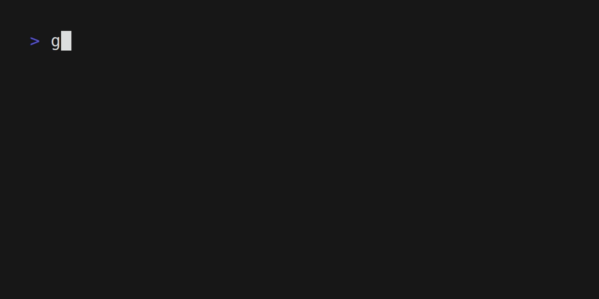

# 🎧 go-ytm

> A blazing-fast terminal-based YouTube Music streamer written in Go.  
> Powered by Cobra CLI and `yt-dlp`, streams audio seamlessly via `mpv`.

---

## 🧰 Requirements

- [Go](https://golang.org/dl/) 1.20+
- [`yt-dlp`](https://github.com/yt-dlp/yt-dlp)
- [`mpv`](https://mpv.io/)

Install them using:

```bash
git clone https://github.com/zachkp/go-ytm.git
cd go-ytm
make
